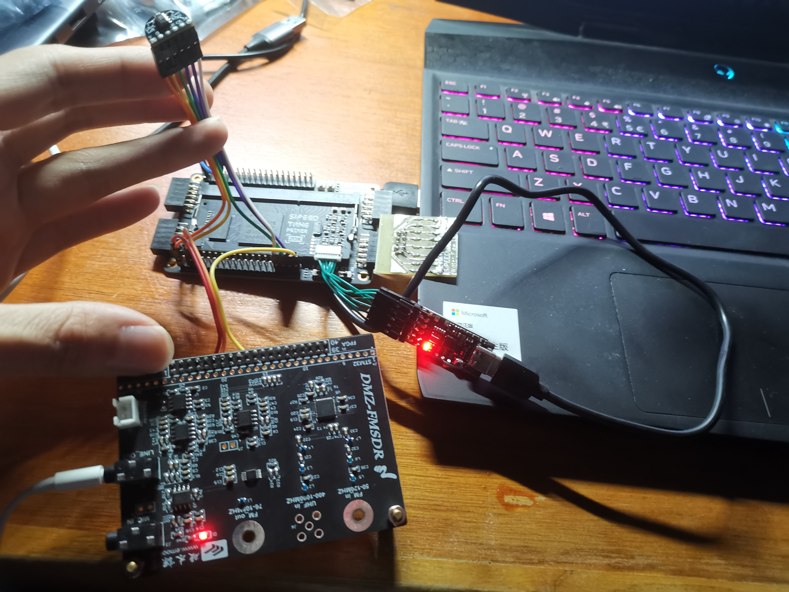

# A Simple Demo on GW2A FPGA to Test Microphone Function

## Interface definition
|   IO   | Location |        notes        |
| ------ | -------- | ------------------- |
| clk27M | H11      | system clk input    |
| rst_n  | T2       | system reset input  |
| mic_sck| K16      | mic sck ouput       |
| mic_ws | H16      | mic ws output       |
| mic_sd | G16      | mic data input      |
| mic_out| K15      | pwm type dac output |

## Experimental phenomena
Microphone captures audio and plays it through headphones.